- [1 接入ZPLAY Ads SDK和AdMob SDK](#1-%E6%8E%A5%E5%85%A5zplay-ads-sdk%E5%92%8Cadmob-sdk)
- [2 在AdMob平台添加ZPLAY Ads广告广告源](#2-%E5%9C%A8admob%E5%B9%B3%E5%8F%B0%E6%B7%BB%E5%8A%A0zplay-ads%E5%B9%BF%E5%91%8A%E5%B9%BF%E5%91%8A%E6%BA%90)
     - [2.1 添加新应用](#21-%E6%B7%BB%E5%8A%A0%E6%96%B0%E5%BA%94%E7%94%A8)
     - [2.2 添加新广告位](#22-%E6%B7%BB%E5%8A%A0%E6%96%B0%E5%B9%BF%E5%91%8A%E4%BD%8D)
     - [2.3 添加ZPLAY Ads广告源](#23-%E6%B7%BB%E5%8A%A0zplay-ads%E5%B9%BF%E5%91%8A%E6%BA%90)

## 1 接入ZPLAY Ads SDK和AdMob SDK
以cocoapods为例，若使用其他接入方式请查看[ZPLAY Ads广告接入文档2.2部分](https://github.com/zplayads/PlayableAdsDemo-iOS/blob/master/README-CN.md#22-%E6%89%8B%E5%8A%A8%E9%9B%86%E6%88%90zplay-ads-sdk)和[AdMob SDK接入文档](https://developers.google.com/admob/ios/quick-start)，以下为简要步骤
1. 在项目终端下执行`pod init`
2. 编辑Podfile，添加库
```object-c
pod 'GoogleMobileAdsMediationZplayAds'
```
如下所示

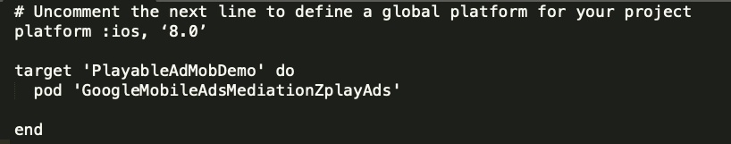


3. 执行`pod install --repo-update` 安装依赖库

> 如果您想了解关于适配器和广告请求的更多详细内容，请参考DEMO中的代码示例。

## 2 在[AdMob](https://apps.admob.com/v2/home)平台添加ZPLAY Ads广告广告源

#### 2.1 添加新应用
a. 选择目录中Apps，点击“ADD APP”按钮
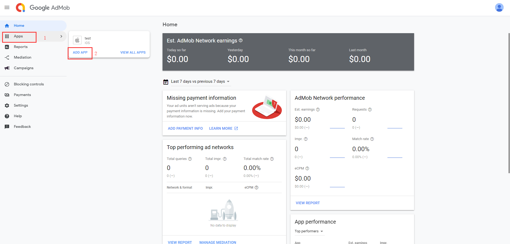

b. 选择您的应用是否已经上架Googleplay或AppStore，若已经上架Googleplay或AppStore请选择“YES”，若未上架请选择“NO”，以下以未上架为例


c. 输入应用名称，选择应用操作系统，点击“ADD”保存添加的应用
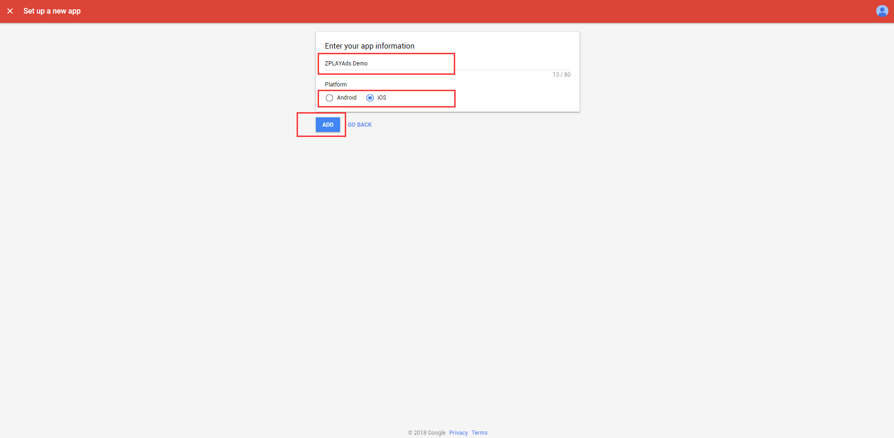

#### 2.2 添加新广告位
a. 添加应用后，点击“NEXT: CREATE AD UNIT”按钮可为此应用添加广告位

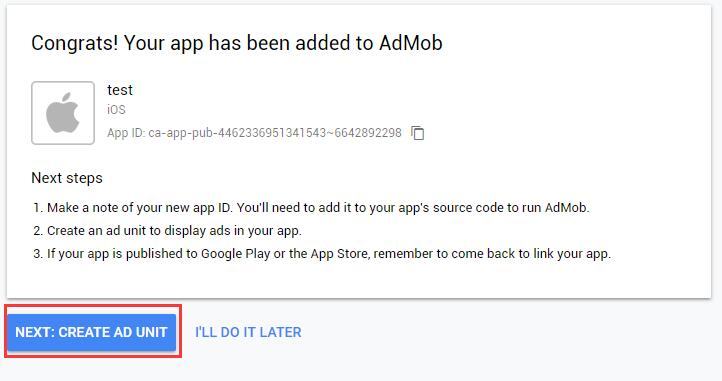

b. 选择您所需要的广告形式，ZPLAY Ads目前支持Interstitial及Rewarded，此处以Rewarded为例

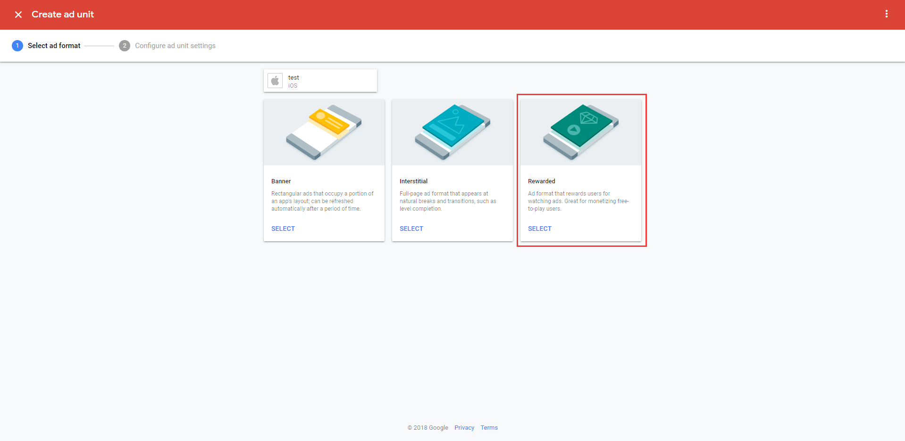

c. 输入广告位名称，点击“CREAT AD UNIT”保存添加的广告位


d. 获取此广告位的app ID及ad unit ID，点击“DONE”完成广告位的创建

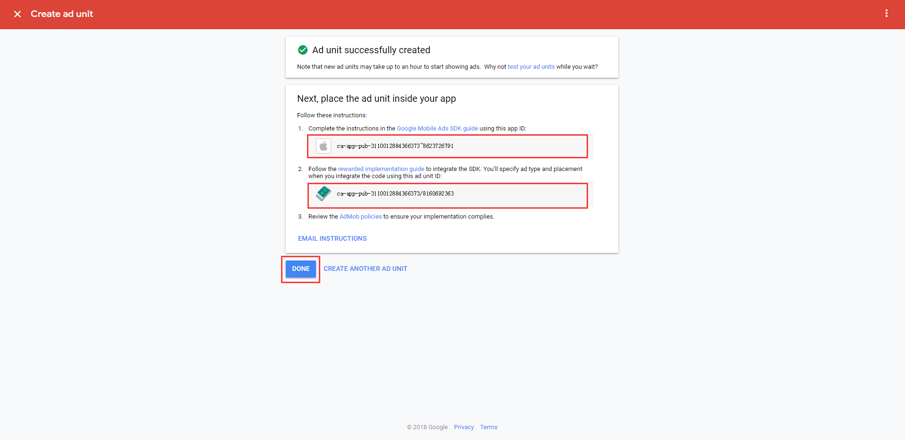

#### 2.3 添加ZPLAY Ads广告源
a. 进入[Mediation目录](https://apps.admob.com/v2/mediation/groups/list)，选择“CREATE MEDIATION GROUP”

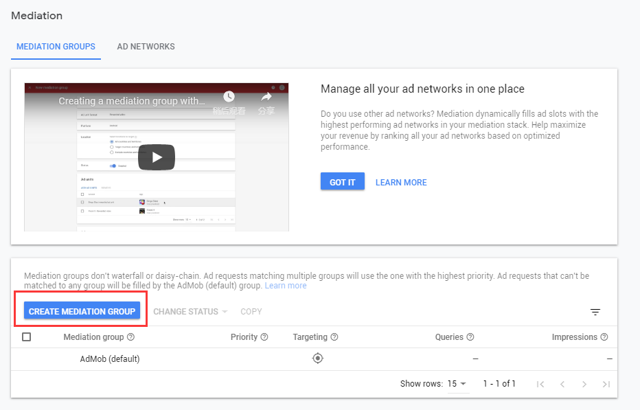

b. 选择您要使用的广告形式及操作系统，ZPLAY Ads目前支持Interstitial及Rewarded video，此处以Rewarded video为例，点击“CONTINUE”进入下一步

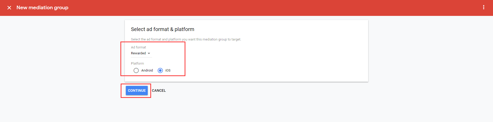

c. 输入Mediation名字，通过Location进行地域设置，状态置位Enable时Mediation才可生效，请确保状态为Enable，点击“ADD AD UNIT”选择要添加的广告位

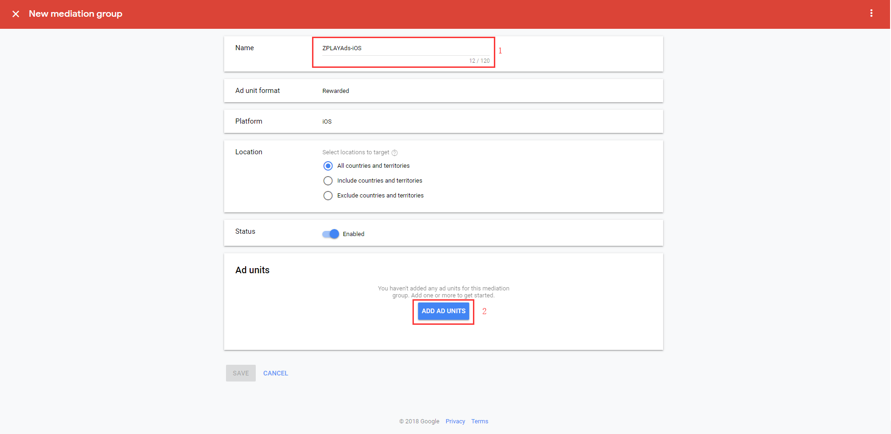

d. 在广告位选择框中，先后选择所需应用及广告位，点击“DONE”

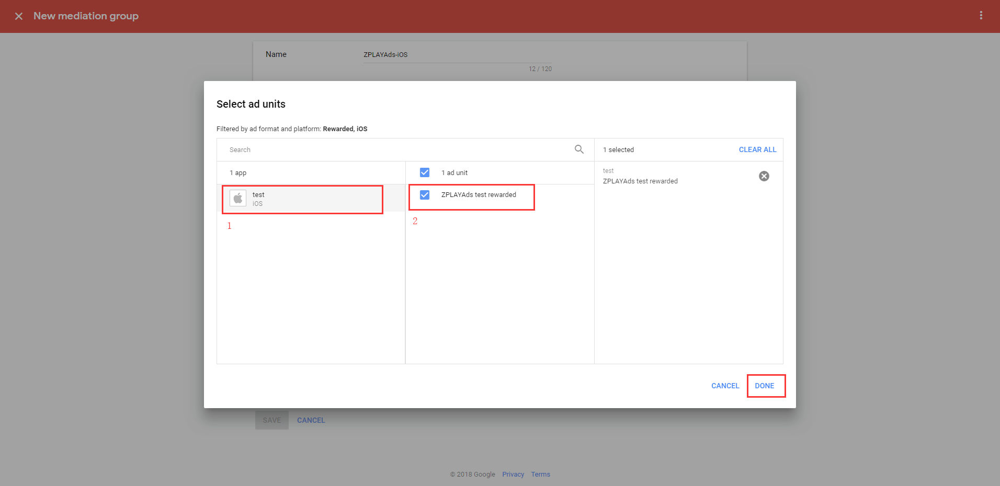

e. 点击“ADD CUSTOM EVENT”添加自定义广告源

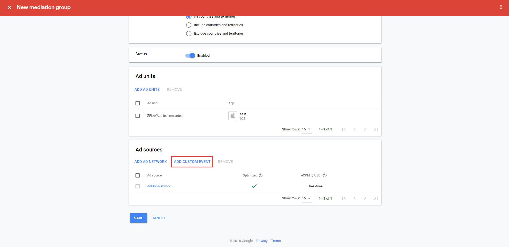

f. 输入第三方广告源名称，此处以ZPLAYAds为例，可根据需求进行自定义，根据需要对第三方广告源进行价格设置

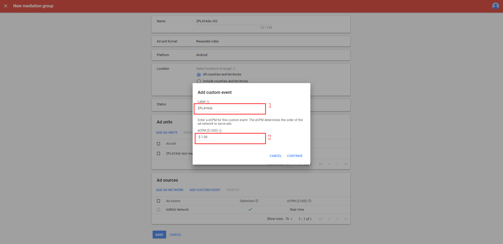

g.  对ZPLAY Ads广告源进行配置，将适配器名称填在Class Name（如下图所示,图片中的类名只是一个示例，请使用以下适配器名称），ZPLAY Ads插屏适配器为ZPLAYAdsAdMobInterstitialAdapter，激励视频适配器为ZPLAYAdsAdMobAdapter。Parameter中需填写[应用ID](https://sellers.zplayads.com/#/app/appList/)和[广告位ID](https://sellers.zplayads.com/#/ad/placeList/)两个参数，通过空格区分且顺序不可更改，点击“DONE”完成ZPLAY Ads的配置
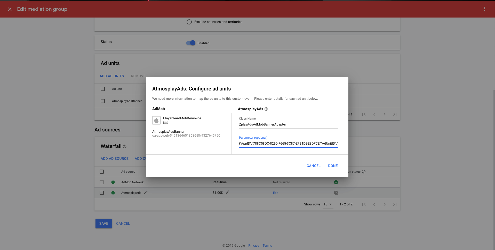

注：您在测试中可使用如下ID进行测试，测试ID不会产生收益，应用上线时请使用您在[ZPLAY Ads](https://sellers.zplayads.com/)申请的正式ID。

| 操作系统 | 广告形式 | App_ID                               | Ad_Unit_id                           |
| ---- | ---- | ------------------------------------ | ------------------------------------ |
| iOS  | 激励视频 | A650AB0D-7BFC-2A81-3066-D3170947C3DA | BAE5DAAC-04A2-2591-D5B0-38FA846E45E7 |
| iOS  | 插屏   | A650AB0D-7BFC-2A81-3066-D3170947C3DA | 0868EBC0-7768-40CA-4226-F9924221C8EB |

h. Ad source列表中可以看到所设置的广告源ZPLAY Ads，点击“SAVE”完成Mediation的配置

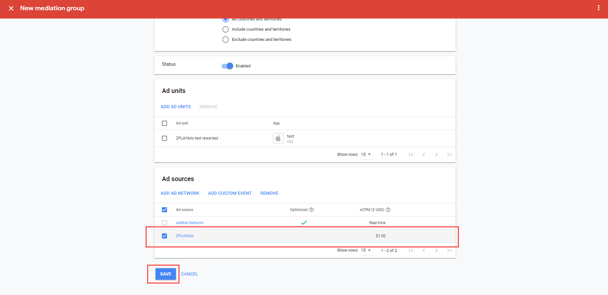

i. 检查第三方广告源是否添加完成，在[Apps列表](https://apps.admob.com/v2/apps/list)中找到步骤d中选择的应用及广告位，广告位Mediation groups中active数量增加表示广告源添加成功

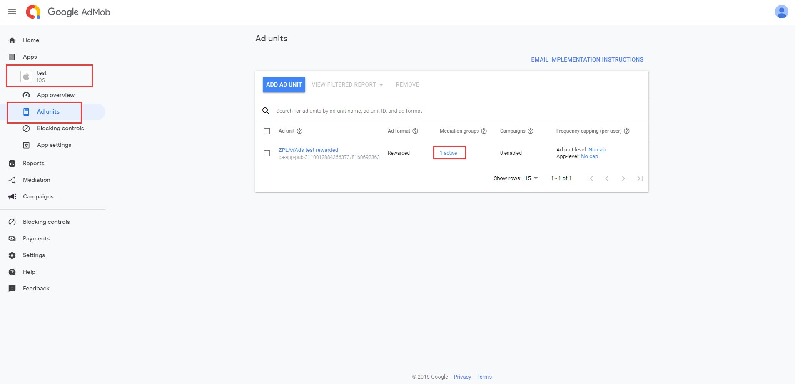