## 一 接入可玩广告SDK和AdMob SDK
以cocoapod为例，其它请查看可玩广告接入文档，AdMob SDK接入文档，以下简要步骤
1. 在项目终端下执行```pod init```
2. 编辑Podfile，添加库
```
# AdMob library
pod ‘Google-Mobile-Ads-SDK’

# PlayableAd library
pod 'PlayableAds', '~>2.0.2'
```
如下所示

3. 执行```pod install --repo-update``` 看到如下信息证明安装完成
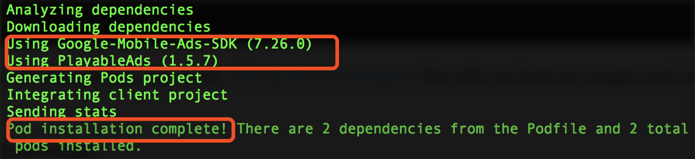
## 二 在AdMob平台添加可玩广告广告源
### 1: 新应用，添加广告位，使其运行可玩广告
a. 输入应用名，这里以PlayableAdMobDemo-ios为例，选择iOS平台，点击“ADD”添加应用
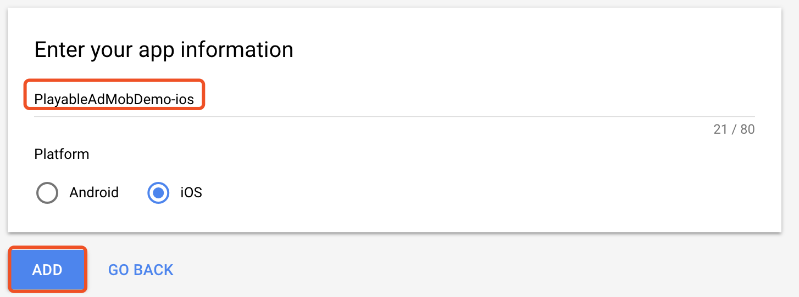
b. 拿到红框内为申请的应用ID，以备后用，点击“NEXT:CREATE AD UNIT”，进行广告位申请。
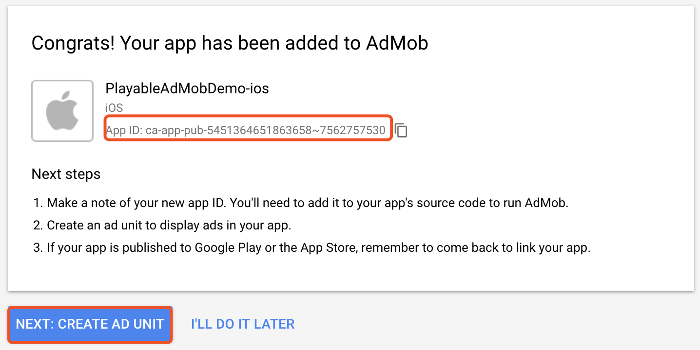
c. 选择广告位广告形式，这里务必选择Rewarded广告形式。点击“SELECT”进入下一步
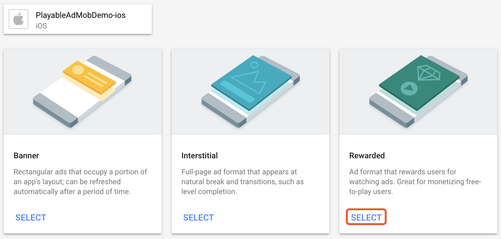
d. 填写广告位名称方便以后管理，这里定为PlayableAdUnit-ios，点击“CREATE AD UNIT”完成创建。
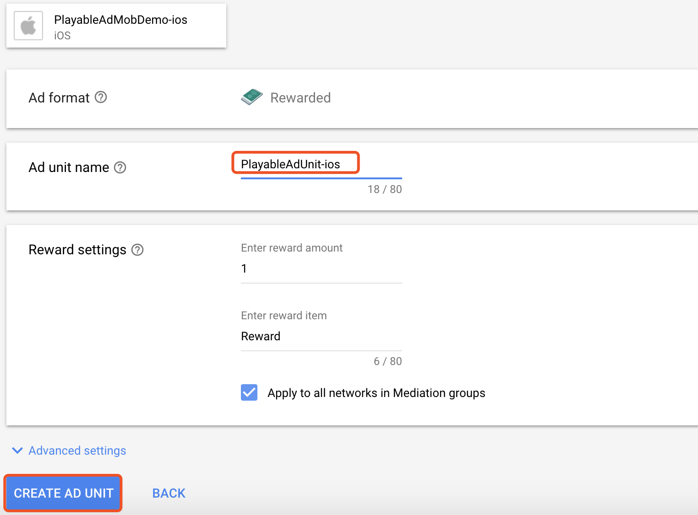
e. 至此，已经获取应用ID和广告位ID均已申请完毕，记录应用ID和广告位ID，点击“DONE”完成申请
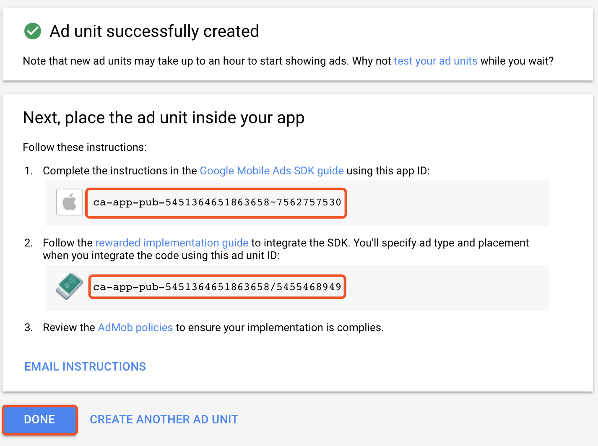
### 2 添加可玩广告源
a. 点击Mediation目录下的“CREATE MEDIATION GROUP”按钮进入广告源设置页面
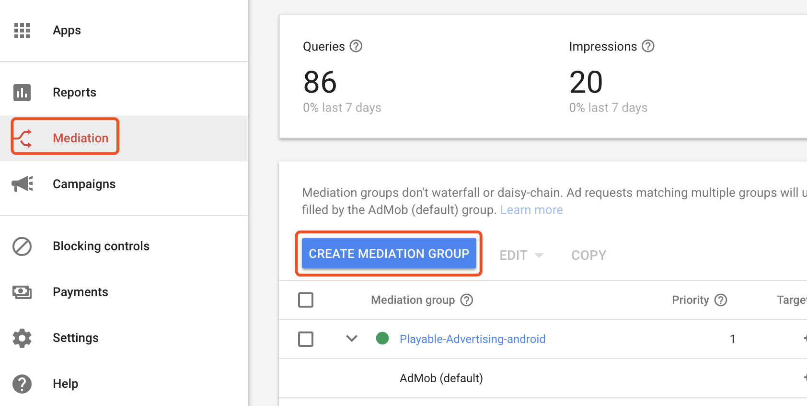
b. 这里务必选择Rewarded video，点击“CONTINUE”进入下一步设置

c. 填写广告源名称方面管理，可根据自己需求填写Name和其它信息，本示例命名为：Playable-Advertising-ios，其它默认。点击“ADD AD UNITS”添加广告位到该广告源。
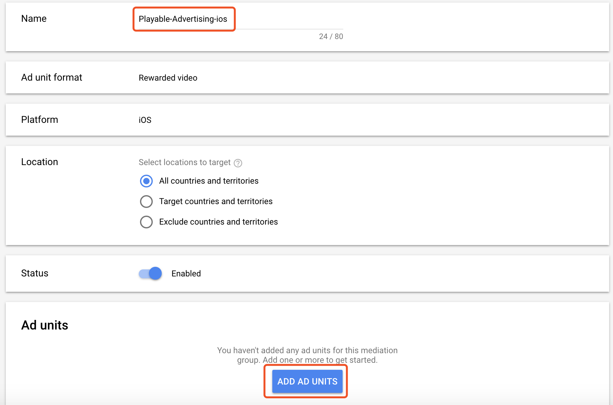
d. 选择步骤1中申请好的广告位，点击“DONE”，进入下一步

e. 添加CUSTOM EVENT以便传递可玩广告信息，比如可玩广告的应用ID和广告位ID

d. 配制可玩广告id，注意，这里Class Name必须与写入项目中的文件名一致，以Demo为例，这里填写PlayableAdMobAdapter，如果没有特殊需要就与示例程序一致即可。Parameter第一个值为可玩广告平台申请的应用ID，第二个值为可玩广告平台申请的广告位ID，注意这两个值的顺序不能更改，且之间只有一个空格，否则可能请求不到可玩广告。
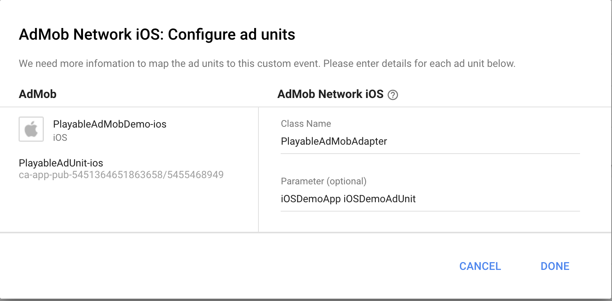
e. 以下图表示已经配制成功，点击“SAVE”将广告源保存。
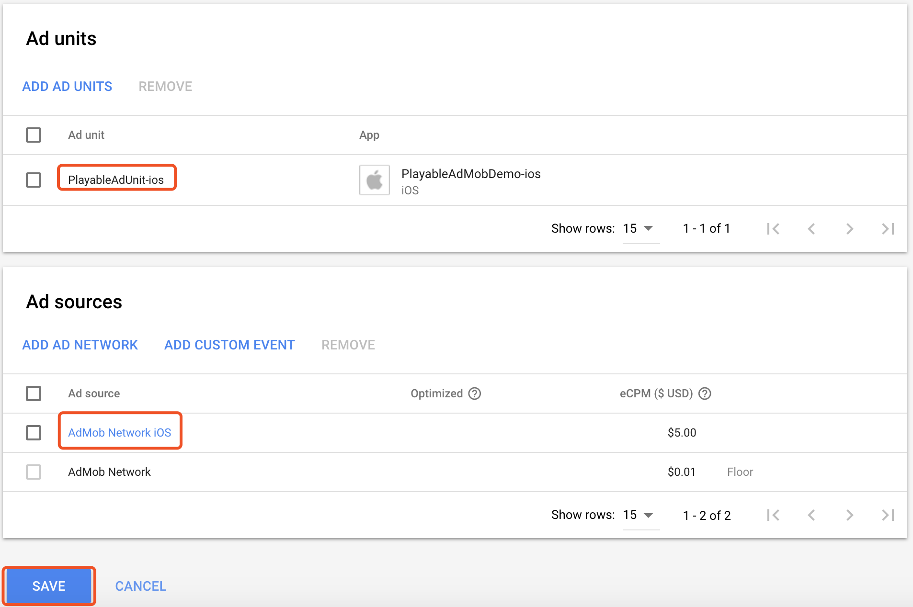
f. 此时，可以看到PlayableAdUnit-ios广告位下已经有了一个三方广告源。
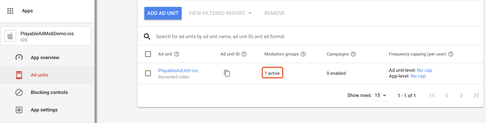

### 3. 已有应用，修改现有广告位，使其支持可玩广告
a. 选择现有广告位，已OldRewardedUnit-ios广告位为例，注意此时三方广告源为0
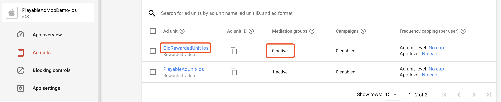
b. 点击"Playable-Advertising-ios"进入广告源
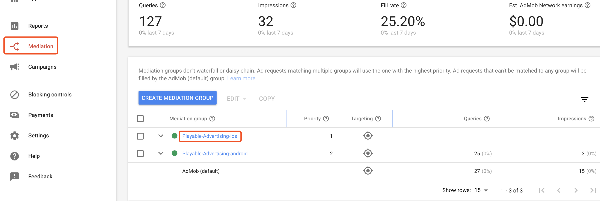
c. 向广告源里添加广告位

d. 选择已经广告位，点击“CONTINUE”进入下一步
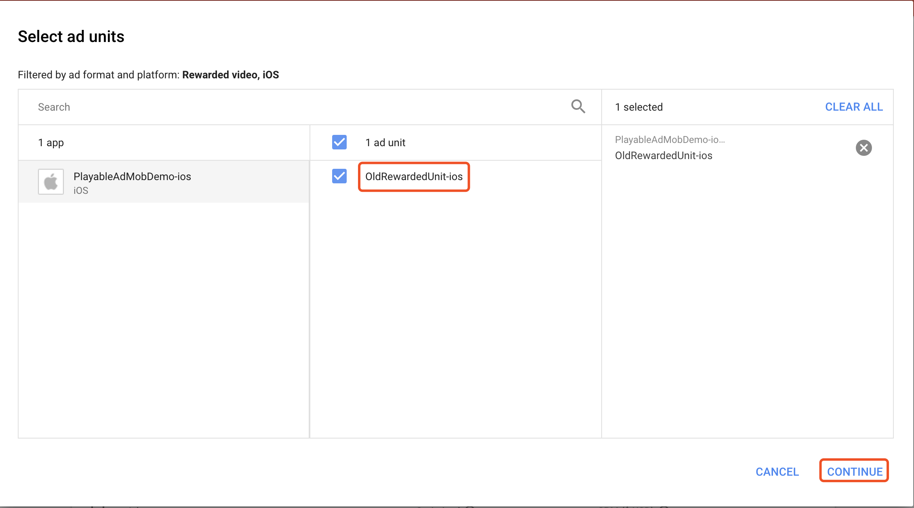
e. 配制适配器以及可玩广告信息，此处与上一节步骤d相同。
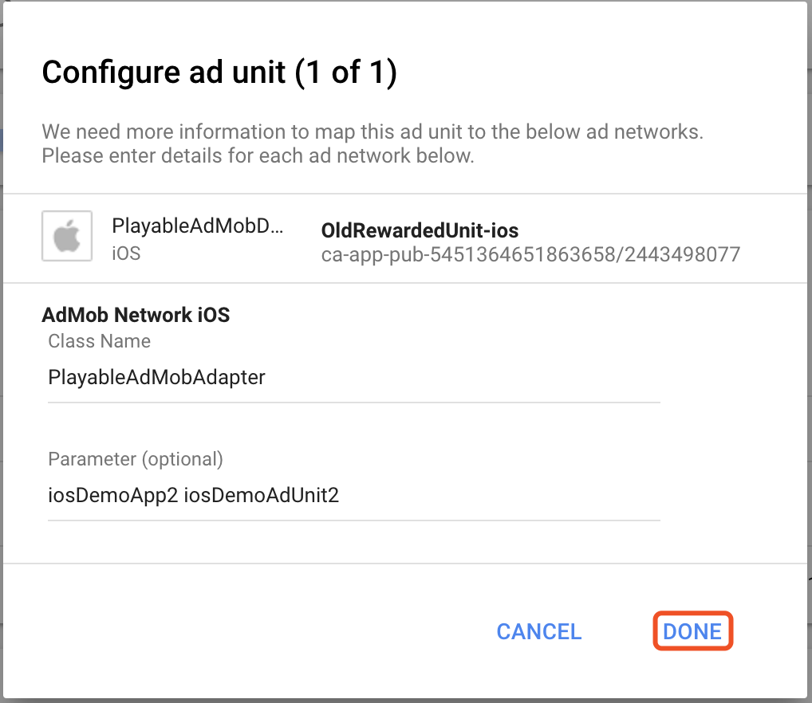
f. 此图表示已经配制完成，点击“SAVE”保存配置
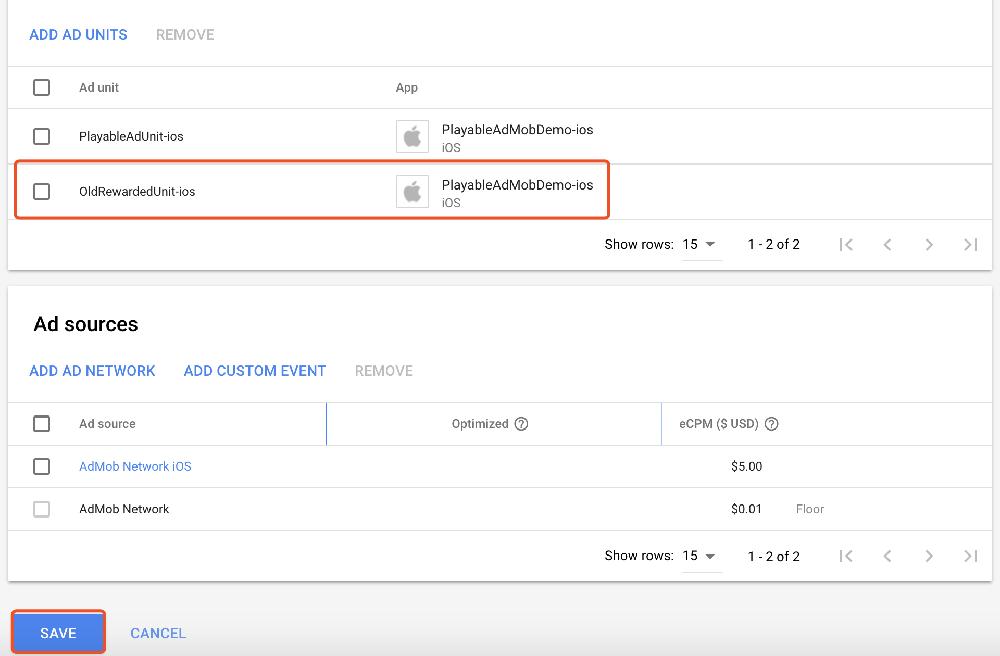
g. 与步骤a对比，此处三方源增加了1，表明配置成功。
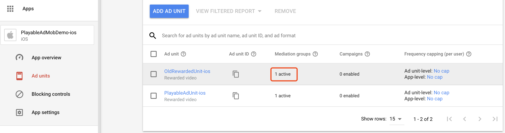
## 三 适配类与请求请参考DEMO
