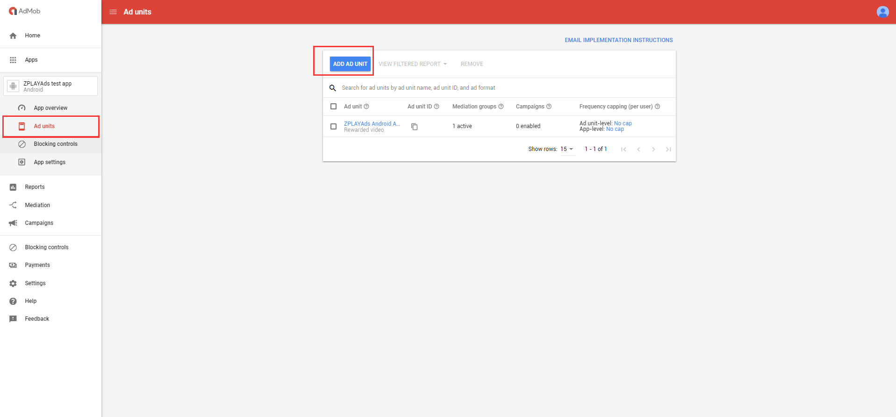

## 1 Integrate ZPLAY Ads SDK and AdMob SDK
Take cocoapods as an example, following are major steps. If you use other platform, please check ZPLAY Ads SDK Integration Guide and AdMob SDK Integration Guide to see details. 

a. Execute ```pod init``` under project terminal. 

b. Edit Podfile, and add library
```
# AdMob library
pod ‘Google-Mobile-Ads-SDK’

# PlayableAd library
pod 'PlayableAds'
```

As follows


c. Execute ```pod install --repo-update``` to install dependent libraries. 

## 2 Add ZPLAY Ads as a New Network on AdMob

#### 2.1 Add New App

a. Click "Apps" in the index, and then click "ADD APP" button. 


b. Choose whether your app has launched in Google Play or App Store, following takes "unlaunched" as an example. 


c. Enter your app information and platform, and click "ADD" to add app.


#### 2.2 Add New Ad Unit

a. Click "Apps" in the index, and choose the app you are going to add ad unit. 


b. Click "ADD AD UNIT" button. 


c. Choose an ad format. ZPLAY Ads supports Interstitial and Rewarded now. Here take Rewarded as an example. 


d. Enter ad unit name and set your ad unit, then click "CREATE AD UNIT" to add ad unit.


e. Acquire app ID and ad unit ID of this ad unit. Click "DONE" to accomplish ad unit creation.


#### 2.3 Add ZPLAY Ads as a New Network on AdMob
a. Choose "Mediation" in the index, and click "CREATE MEDIATION GROUP" button.


b. Choose ad format and platform. ZPLAY Ads supports Interstitial and Rewarded now. Here take Rewarded as an example. Click "CONTINUE" button to go on. 


c. Enter name of Mediation and set target locations through Location function. The Mediation will be enabled only when the Status controller has switched to "Enable". Click "ADD AD UNITS" to choose ad unit. 


d. Choose app and ad unit in selection box, and click "DONE" to save the ad unit you configured.


e. Click "ADD CUSTOM EVENT" to add custom ad sources.


f. Enter label of third party ad source, you can customize it according to your requirements. Here takes ZPLAY Ads as an example. Then you can set eCPM according to your requirements. 


g. Configure ZPLAY Ads ad source. Fill in adapter name in Class Name, which means replace ZPLAYAds (as following image shows) with full name of adapter name(**bundle name+class name**) . As for the example, the Rewarded's adapter name is ```com.zplay.playable.playableadmobdemo.ZPLAYAdsAdMobAdapter```, and the Interstitial's adapter name is ```com.zplay.playable.playableadmobdemo.ZPLAYAdsAdMobInterstitialAdapter```. Parameter contains two values, the first value is App ID which applied in ZPLAY Ads, and the second value is Ad Unit ID which applied in ZPLAY Ads. Please note that the sequence of two values should not be changed, and there is only one blank between two values. Click "DONE" to accomplish configuration. 


Note: You are available to use the following ID when testing(not charge). Please switch to the ID you applied in production mode.

|OS|Ad Format|App_ID|Ad_Unit_id|
|---|---|---|---|
|iOS|Rewarded|A650AB0D-7BFC-2A81-3066-D3170947C3DA|BAE5DAAC-04A2-2591-D5B0-38FA846E45E7|
|iOS|Interstitial|A650AB0D-7BFC-2A81-3066-D3170947C3DA|0868EBC0-7768-40CA-4226-F9924221C8EB|

h. You can see ZPLAY Ads in Ad sources list. Click "SAVE" to accomplish configuration of Mediation. 


i. Check whether third party ad source has been added successfully. Find app and ad unit choosed in step d in app list. In the Mediation groups column, if the number of active increased, then the ad source has been added successfully.


## 3 About Adapter and Request, please refer to the DEMO. 


